# 边缘云和边缘智算

## 注意 ⚠️

- _斜体表示引用_
- **未经允许，禁止转载**

## 1. 行业理解

### 1.1 边缘云的定义

云计算发展史，就是虚拟化技术的发展史。近 20 年来云计算与互联网相互促进高速发展，中心云技术成为全社会通用的基础设施。随着物联网、人工智能等技术的不断发展，尤其是产业互联网发展落地，中心云计算开始相形见绌，分散式边缘计算在当下被重新寄予厚望。

几乎所有的新事物，都会由业务价值驱动；在 IT 届，技术创新驱动占据的比例稍大一些。

#### 1.1.1 从边缘计算到 MEC

边缘计算到边缘云的演进过程：

1. “边缘计算”起源于 CDN，强调靠近终端，满足“实时”、“安全”需求。
    - 最早在 20 世纪 90 年代，被 Akamai 公司提出，该公司推出了内容传送网络（CDN），CDN 网络在接近终端用户设立了传输节点，这些节点能够存储缓存的静态内容，如图像和视频等
    - 边缘计算产业联盟对编译计算的定义：在靠近物或数据源头的网络边缘侧，融合网络、计算、存储、应用核心能力的开放平台，就近提供边缘智能服务，满足行业数字化在敏捷连接、实时业务、数据优化、应用智能、安全与隐私保护等方面的关键需求
2. “[雾计算](https://cloud.tencent.com/developer/article/1540419)”可以被认为是“边缘计算”的一种形式
    - “雾计算”由思科在 2011 年提出，是相对于“云计算”而言的，“雾计算”由性能较弱、更为分散的各种功能计算机组成，渗入电器、工厂、汽车、街灯及人们生活中的各种物品。“雾计算”拓展了云计算（Cloud Computing）的概念，相对于云计算它离产生数据的地方更近，数据、数据相关的处理和应用程序都集中于网络边缘的设备中，而非保存在云端
    - “雾计算”的核心目标在于：通过在靠近用户的地方处理数据来减少服务器的负载，将低密度的信息流在网络节点上处理成高密度的信息，再交付给云端
    - “雾计算”和边缘计算没什么本质区别，思科给出的区别是边缘计算更靠近终端，而雾计算更靠近云。可以认为“雾计算”是思科为了推销网络设备而提出的概念
3. MEC 是“边缘计算”在 CT 电信通信网上的演变和延伸
    - 边缘计算是一种**网络技术**，通过在靠近数据源（如传感器和设备）的地方收集和处理数据，减少云服务器的流量
    - MEC 由 ETSI 提出，是边缘计算的演变，**考虑了移动通信标准**，是在移动网络中实现**超低延迟**和**顶级安全性**的重要技术
    - [MEC 的兴起和 5G 息息相关](https://blog.stratus.com/zh/what-is-the-difference-between-mec-multi-access-edge-computing-and-edge-computing-network-technology-that-maximizes-the-transmission-capacity-of-5g-communication/)，5G 提供了超高速通信（eMBB）、超低延迟通信（URLLC）和多路同时连接（mMTC），和 MEC 相结合，能实现网络负载减少、低延迟和高安全性
    - 比较热门的应用场景是：自主驾驶 / 自主机器人 / 视频分析 / VR / AR / MR

边缘计算的定义各有侧重，但核心思想基本一致：**边缘计算**是基于云计算核心技术，构建在边缘基础设施之上的新型分布式计算形式，在边缘端靠近最终用户提供计算能力，**是一种靠近数据源的现场云计算**。

- 中心云计算凭借其强大的数据中心，为业务应用提供大规模池化，弹性扩展的计算、存储、网络等基础设施服务，更适用于非实时、长周期数据、业务决策场景
- 边缘计算则聚焦在实时性、短周期数据、本地决策等业务场景，比如当下热门的音视频直播、IoT、产业互联网、虚拟现实甚至元宇宙等，将工作负载下沉至离终端设备或者靠近最终用户的地方，以此实现更低的网络延迟，提升用户的使用体验。

#### 1.1.2 ETSI 对 MEC 的定义

通信网络和边缘计算的演进关系图：

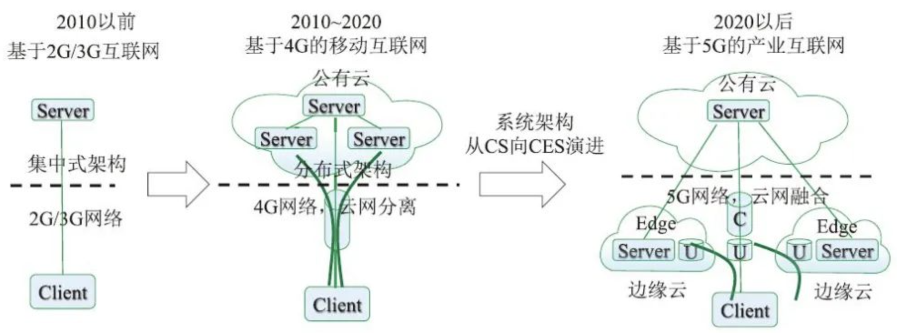

ETSI 率先提出了 [MEC 架构](https://www.etsi.org/technologies/multi-access-edge-computing)

- 定义其概念：Multi-access Edge Computing，offers application developers and content providers cloud-computing capabilities and an IT service environment at the edge of the network
- 强调其特点：**超低延时**、**高带宽**、**无线访问**
- 描述其生态：**向三方应用厂商开放 RAN**，使他们能够灵活快速地向移动用户、企业和垂直细分市场部署创新的应用程序和服务

[MEC 架构图](https://www.etsi.org/deliver/etsi_gs/mec/001_099/003/02.01.01_60/gs_mec003v020101p.pdf)：

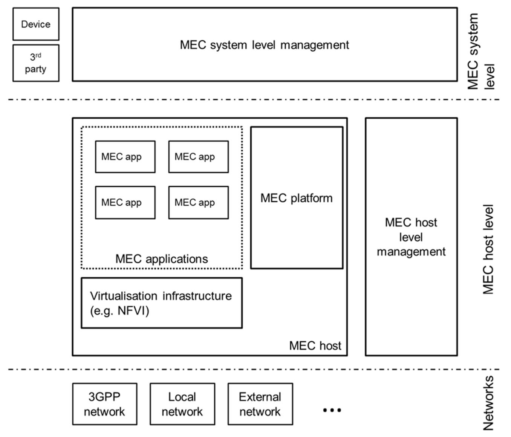

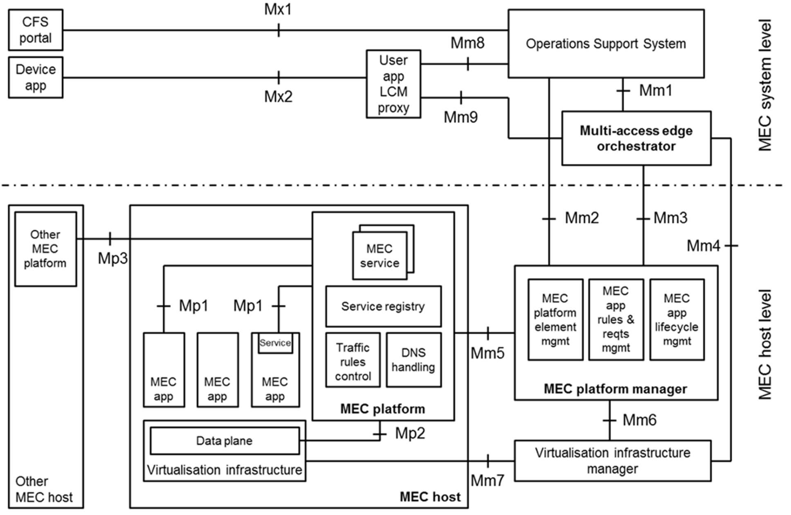

[NFV 架构图](https://www.etsi.org/deliver/etsi_gs/mec/001_099/003/02.01.01_60/gs_mec003v020101p.pdf)

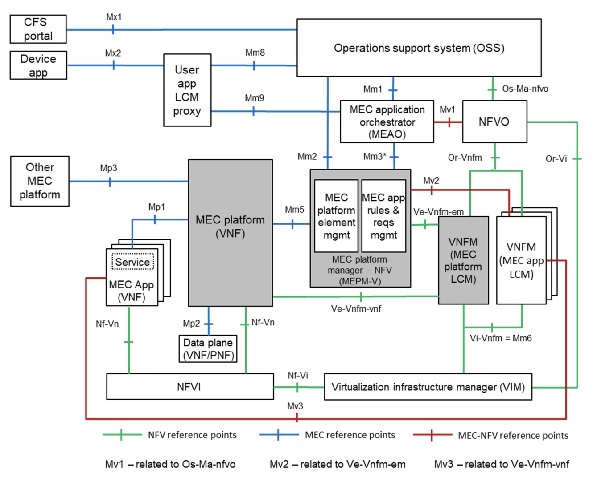

MEC 和 5G 的关系：

MEC是一个边缘云平台，通过与5G网络结合（UPF是结合点），提供一种新的网络架构，将移动接入网与互联网业务深度融合，一方面通过本地分流来降低时延，满足用户极致体验需求，并节省带宽资源。另一方面将计算能力下沉到网络边缘位置，提供第三方应用集成，为移动边缘入口的服务创新提供了无限的想象空间。

MEC 和 5G 的交互接口：

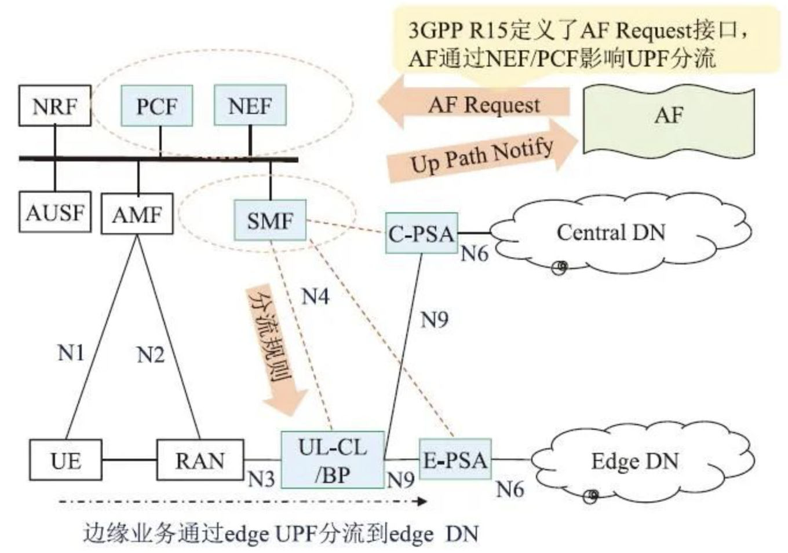

3GPP 早期定义 AF（Application Function）时，参考了 IP 多媒体系统架构，即一个应用产生的业务流可以分为控制面和用户面。AF 最早是多媒体业务的控制面，在与网络中，与 PCF（Policy Control Function）等交互，这样可以简化应用控制面设计。

在 5G 网络架构中，5GC 的控制面与用户面分离，用户面 UPF 可以灵活地下沉部署到网络边缘，而策略控制 PCF 以及会话管理 SMF（Session Management Function）等控制面功能可以集中部署。5GC（5G Core Network）对外交互依然是控制面和用户面。然而，OTT 应用架构没有控制面和数据面，基于 HTTP 的 Web 业务本质上混合了业务控制和业务数据。因此，3GPP提出了边缘计算 AF 的定义需求，MEC 作为 AF 需要能够从“业务控制面和/或业务用户面”感知到 OTT 应用的业务状态，然后才能代表应用和 5GC 交互。

当 5G 网络支撑边缘计算时，Application Function 向 NEF（非授信域）或者向 PCF（授信域）发送 AF Request，其中包含目标 DNN 和 S-NSSAI、应用 ID、N6 路由需求、应用位置（DNAI 信息集）、UE 信息、应用移动性指示、空间和时间有效条件等一系列参数。PCF 根据 AF 提供的这些信息参数，结合自身策略控制，为目标 PDU（Protocol Data Unit）Session 业务流生成 PCC 规则，通过 SMF 为其选择一个合适的 UPF（如：靠近 UE 的 DNAI），并配置 UPF 如何把目标业务流通过 N6 接口传输到目标应用实例。同时，5GC 通过用户面管理事件消息通知 AF，UPF 位置改变，这样 AF 可以对应改变应用的部署位置。此时，Application Function 相当于应用控制面的角色，提供应用与网络控制面之间的交互。

ETSI 判断的 MEC 应用方向：

- 车联网
- 无人机
- 游戏
- 视频分析
- 定位服务
- 物联网（IoT）
- 增强现实
- 优化本地内容分发和数据缓存

#### 1.1.3 国内运营商对 MEC 和边缘云的定义

2018-2019 年，中国电子技术标准化研究院发布《[边缘云计算技术与标准化白皮书](https://www.cesi.cn/images/editor/20181214/20181214115429307.pdf)》。

1. 定义边缘云计算的概念
    - 首次定义“边缘云”：**构筑在边缘基础设施之上的云计算平台**。边缘云是基于云计算技术的核心和边缘计算的能力，构筑在边缘基础设施之上的云计算平台。形成边缘位置的计算、网络、存储、安全等能力全面的弹性云平台，并与中心云和物联网终端形成“云边端三体协同” 的端到端的技术架构，通过将网络转发、存储、计算，智能化数据分析等工作放在边缘处理，降低响应时延、减轻云端压力、降低带宽成本，并供全网调度、算力分发等云服务
    - 中心云和边缘云相互配合，实现中心-边缘协同、全网算力调度、全网统一管控等能力，真正实现“无处不在”的云。边缘云计算能够最大程度上与传统云计算在架构、接口、管理等关键能力上实现统一，最终将边缘设备与云进行整合，成为**云的一部分**
2. [描述边缘云计算的典型应用场景](https://developer.aliyun.com/article/686231)
    - **全网覆盖类应用**：要求从边缘节点在地区和运营商网络两个层面上的覆盖度，来保证就近计算（如 CDN、互动直播、边缘拨测/监控等业务），或者基于足够多的节点进行网络链路优化(如 SDN/SD-WAN、在线 教育、实时通信等)。
    - **本地覆盖类应用**：要求边缘节点的本地化，即边缘节点的接入距离要足够近(目标 < 30 公里)，时延足够低(目标 < 5ms)，来支持本地化服务的上云需求，例如新零售、医疗等行业的监控数据上云，连锁门店等线下行业的 IT 基础设施上云等。这类应用的大带宽需求是最能体现边缘云计算时延和成本优化等核心优势的场景。 
3. 定义边缘云计算的技术特点
    - 低延时：因边缘云计算就近提供计算和网络覆盖，数据的产生、处理和使用都发生在离数据源很近的范围内，接收并响应终端请求的时延极低
    - 自组织：当网络出现问题甚至中断时，边缘云的节点可以实现本地自治和自恢复
    - 可定义：边缘云服务及业务逻辑不是一成不变的，而是可以由用户修改、更新和定制
    - 可调度：业务逻辑可以由中心云动态分发，具体在哪个边缘节点执行是可以调度的
    - 高安全：能够供与传统云计算一体化的安全防护能力
    - 标准开放：供标准化且开放的环境，具有和其他系统互联及互操作的能力
4. 边缘云计算标准化需求和关键能力
    - 统一协同能力：
        - 统一控制管理
        - 管控通道的高可用和稳定性
        - 业务调度协同
        - 大数据处理协同
        - 云边一体化安全能力
        - 统一开放的服务接口
    - 服务能力：
        - 边缘云计算基础设施服务，如计算、存储、网络、加速器等
        - 边缘云计算平台服务，如容器服务、大数据服务、人工智能服务、vCDN、 即时通信服务 RTC、视频 AI、音视频通信等

多种云的统一管理

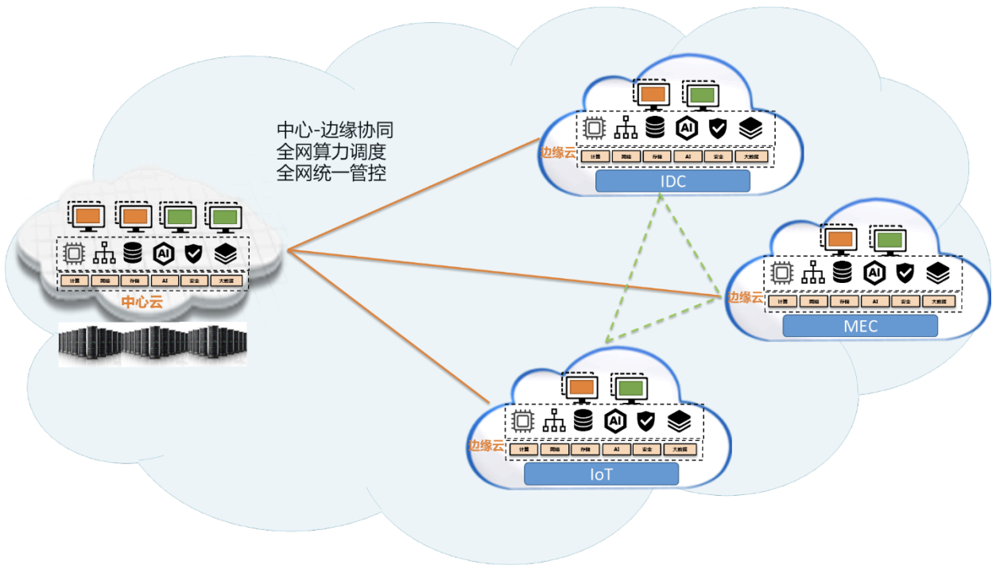

核心能力

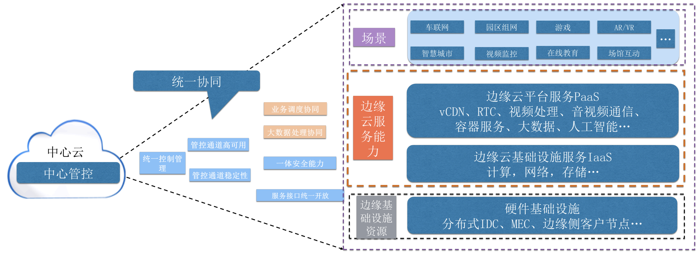

云边端三层架构：

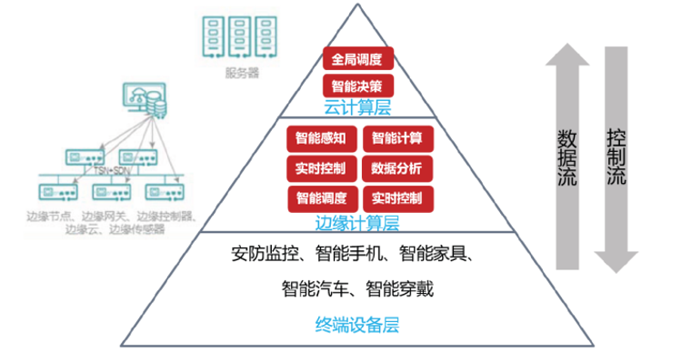

##### 1.1.3.1 案例：视频处理场景

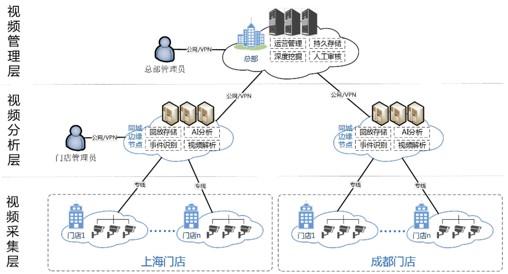

整个边缘云计算系统被分为三层：

1. 视频采集层：门店对视频数据进行采集，仅配置监控摄像头及必要的网
络设备，不再需要配置大量的计算和存储设备。各门店以专线接入同城
边缘节点，实时上传视频监控流。
2. 视频分析层：边缘节点为同城各门店ᨀ供基础设施服务以承载 AI 分析、
视频结构化解析、回放存储等，替换原本在门店中的物理服务器组。边
缘节点以优选公网链路，回传至云中心。
3. 视频管理层：中心云的相关平台对接全网上报的数据，做统一运营管理、
人工审核、关键数据的持久存储等。

##### 1.1.3.2 案例：智慧城市

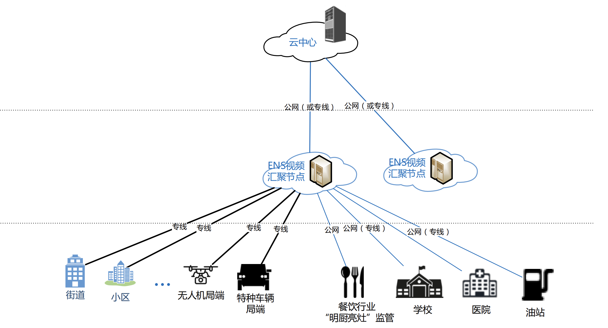

此类应用一般属于本地覆盖类应用。智慧城市需要信息的全面感知、智能识
别研判、全域整合和高效处置。智慧城市的数据汇集热点地区、公安、交警等数
据、运营商的通信类数据、互联网的社会群体数据、IoT 设备的感应类数据。智
慧城市服务需要通过数据智能识别出各类事件，并根据数据相关性对事态进行预
测。基于不同行业的业务规则，对事件风险进行研判。整合公安、交警、城管、
公交等社会资源，对重大或者关联性事件进行全域资源联合调度。实现流程自动
化和信息一体化，提高社会处置能力。

- 在采集层，海量监控摄像头采集原始视频并传输到就近的本地汇聚节点。
- 在感知层，视频汇聚节点内置来自云端下发的视觉 AI 推理模型及参数，完
成对原始视频流的汇聚和 AI 计算，获取结构化特征信息。
- 在应用层，城市大脑可根据来自各个汇聚节点上报的特征信息，全面统筹规
划形成决策，还可按需实时调取原始视频流。

这样的“云—边—端”三层架构的价值在于：

1. 提供 AI 云服务能力：边缘视频汇聚节点对接本地的监控摄像头，可对各
种能力不一的存量摄像头普惠地提供 AI 能力。云端可以随时定义和调
整针对原始视频的 AI 推理模型，可以支持更加丰富、可扩展的视觉 AI
应用。
2. 视频传输稳定可靠：本地的监控摄像头到云中心的距离往往比较远，专
网传输成本过高，公网直接传输难以保证质量。在“先汇聚后传输”的
模型下，结合汇聚节点（CDN 网络）的链路优化能力，可以保证结构化数据和原始视频的传输效果。
3. 节省带宽：在各类监控视频上云的应用中，网络链路成本不菲。智慧城
市服务对原始视频有高清码率和 7×24 采集的需求，网络链路成本甚至
可占到总成本的 50%以上。与数据未经计算全量回传云端相比，在视频
汇聚点做 AI 计算可以节省 50%~80%的回源带宽，极大降低成本。

与用户自建汇聚节点相比，使用基于边缘云计算技术的边缘节点服务（ENS）
作为视频汇聚节点具有以下的优势：

1. 交付效率高：ENS 全网建设布局，覆盖 CDN 网络的每个地区及运营商，
所提供的视频汇聚服务，各行业视频监控都可以复用，在交付上不需要
专门建设，可直接使用本地现有的节点资源。
2. 运营成本低：允许客户按需购买，按量付费，提供弹性扩容能力，有助
于用户降低首期投入，实现业务的轻资产运营。

##### 1.1.3.3 直播案例

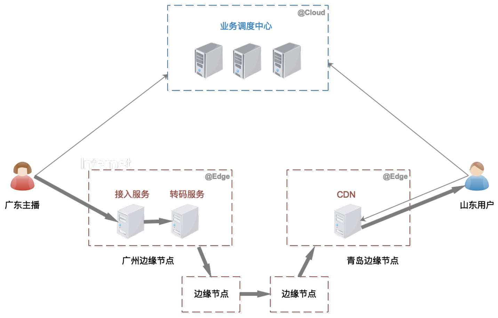

此类应用一般属于全网覆盖类应用。

主播的媒体流推送到就近的边缘节点，在边缘节点直接进行转码，转码后的
媒体流分发到 CDN 边缘节点，当有用户访问时就近返回内容。基于边缘节点上的
服务、直播流的上下行内容推送以及转码处理等都不用再回中心，大大降低了业
务时延，提升了互动体验，同时边缘处理架构对带宽成本的节省也非常明显。

边缘云计算服务在主播直播推流时，实现就近节点进行转码和分发，同时支
持高并发实时弹幕的边缘分发，减少了对中心的压力，节省了 30% 以上的中心带
宽成本，同时获得网络低时延，实现了边缘节点网络连接时延小于 5 毫秒，ᨀ升
了主播上行质量和用户观看体验。通过基于边缘云计算技术的边缘节点服务
（ENS）与 CDN 资源协同，为虎牙直播提供稳定可靠的计算和网络服务，实现了
弹性伸缩和分钟级交付的能力，具备了规模经济性，节省了用户带宽成本。

#### 1.1.4 设备厂商对 MEC 的思考

- 自动部署动态上行分类器，保障快速移动场景下的业务连续性
- 基于大数据和 AI 对边缘业务分析结果的开放 API，实现自动化的业务自愈和自优化
- 基于用户、业务的动态切片，以及基于运营商 5G 运维管理系统，实现自动化运维
- 从 Cloud Native 架构、极强联接、极致性能、极简运维

#### 1.1.5 MEC 的当下和未来

2024年7月18日，第四届“[云边协同大会暨首届分布式算力论坛](http://www.ecconsortium.org/Lists/show/id/1290.html)”在北京召开：

1. 边缘原生
2. 大规模边缘节点管理
3. 云边数据协同治理
4. 边缘 AI
5. 5G 边缘计算规模化复制
6. 边缘算力网络：算力时延圈 < 1ms
7. 定制化边缘硬件
8. 边缘安全加速

边缘计算的发展不仅依赖于底层通信技术、人工智能（AI）技术和大数据技术的支持，而且[智能边缘计算已成为 AI 与 5G 技术结合的重要组成部分](https://m.21jingji.com/article/20240301/herald/5fb608c1368413862ce988db14918190.html)，对于释放大量应用场景中的数据价值具有关键意义。预计未来边缘计算将与 5G 网络技术、AI技术等实现更深度的融合。

政策方面，中国政府出台了一系列政策以支持和鼓励边缘计算及相关产业的发展，这对于行业的快速成长起到了积极的推动作用。据预测，到 2027 年，中国边缘计算市场规模将达到 2599.05 亿元，2023-2027 年间的复合增长率将达到30%。

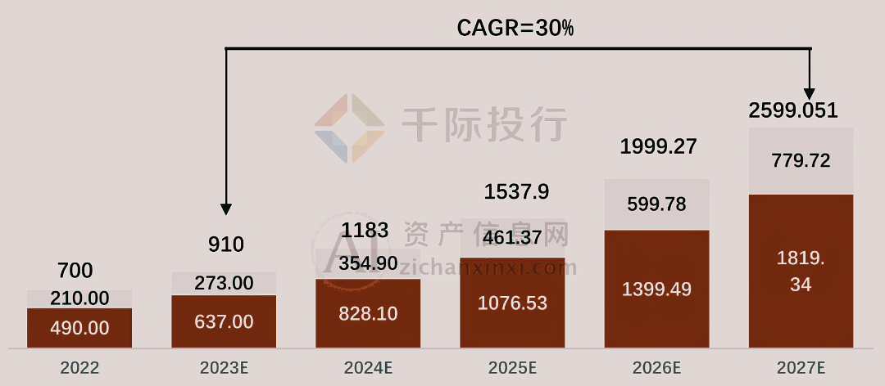

应用场景：

- 互动直播、视频内容分发网络(VCDN)、安防监控等领域已开始大规模落地
- 车联网、云游戏、工业互联网、智慧园区、智慧物流等应用场景日趋成熟
- 互联网领域，尤其是音视频、云游戏等场景，是边缘计算下游应用拓展的重点

##### 1.1.5.1 区域云 & V2X

中国汽车工程学会在 2024 年发布了《[车路云一体化系统云控基础平台功能场景参考架构 1.0](https://zhishi.sae-china.org/read/?id=4891)》，提出了区域云的概念。

第二波车联网热潮兴起

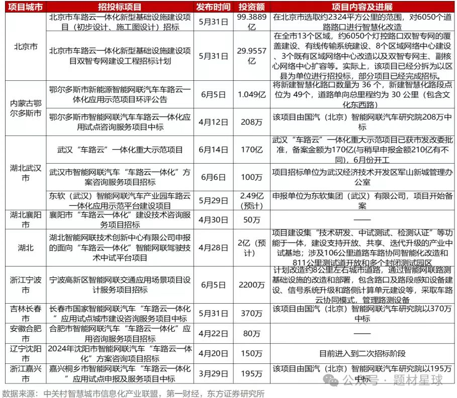

1. 之前主要是单车智能，现在明确说要中心，区域，边缘，单车，四者协同交互，冗余决策
2. 之前主要是通信和协同控制，就近决策。这个文档里提到云端的海量数据分析。应该是大量非实时决策下发，包括娱乐。因此以前车联网上的 AI 主要是汽车动力学和一般机器学习，现在这样的话肯定会有深度学习乃至大模型。云这边就要加对应的 GPU 适配管理，模型管理，协同算力调度，数据调度这些。

车联网架构：

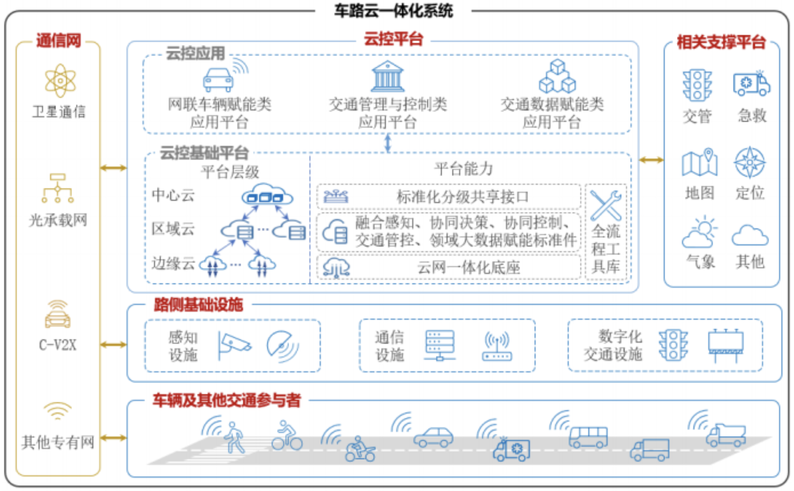

##### 1.1.5.2 端侧设备管理

在边缘计算场景，端侧设备才是平台真正的服务对象。

一般基于云原生理念，抽象非侵入、可扩展的设备管理标准模型，无缝融合 Kubernetes 工作负载模型与 IoT 设备管理模型，实现平台赋能业务的最后一公里。通过标准模型完成 EdgeX Foundry 开源项目的集成，可以大幅提升边缘设备的管理效率。

本地资源管理：在边缘计算场景，将边缘节点上已有的块设备或者持久化内存设备，初始化成云原生便捷使用的容器存储：LVM / Dynamic-LocalPath / QuotaPath

##### 1.1.5.3 安全增强

基于 [Intel SGX](https://github.com/intel/linux-sgx) 加密计算新增安全增强型云主机。通过 SGX 扩展指令，保护代码和数据不受修改。

##### 1.1.5.4 算力网络

[华为算力网络](https://info.support.huawei.com/info-finder/encyclopedia/zh/%E7%AE%97%E5%8A%9B%E7%BD%91%E7%BB%9C.html)看似是一张网，联接了所有的计算节点，实际是将所有计算节点的算力汇集到一个算力池中，实现算力的“一点接入，即取即用”。

由于5G、边缘计算、人工智能、区块链等新因素带来了新的变量，使得算法需要综合考虑这些方面，从而形成了算力网络的三大功能。

- 算力路由：网络能感知算力，并为其提供最优算力路由
- 算力调度：算网大脑智能编排、弹性调度全网算力资源
- 算力交易：基于区块链的算力可信和算力网络交易平台

[Amazon 算力网络](https://www.amazonaws.cn/knowledge/what-is-computing-power-network/)

算力网络是由网络、算力和存储等技术共同构成的一种信息基础设施。算力网络一般具备以下4个特点：

- 资源抽象：计算、存储和网络资源均为算力网络中的组成部分，因此算力网络在为客户提供服务时，需要将其中的资源抽象出来再提供给客户
- 业务保障：向用户提供算力网络服务时，需要根据客户的具体需求划分服务等级，从而保障用户拥有足够的算力、网络资源支持
- 统一管控：算力网络中的云计算、边缘计算节点以及网络资源均为统一管理，服务中会根据具体的业务需求进行统一调度
- 弹性调度：算力网络可实时监测业务流量，并根据流量调用情况，动态调整算力资源，以保证算力网络中各项资源合理分配

### 1.2 MEC 的能力边界

#### 1.2.1 边缘计算的位置

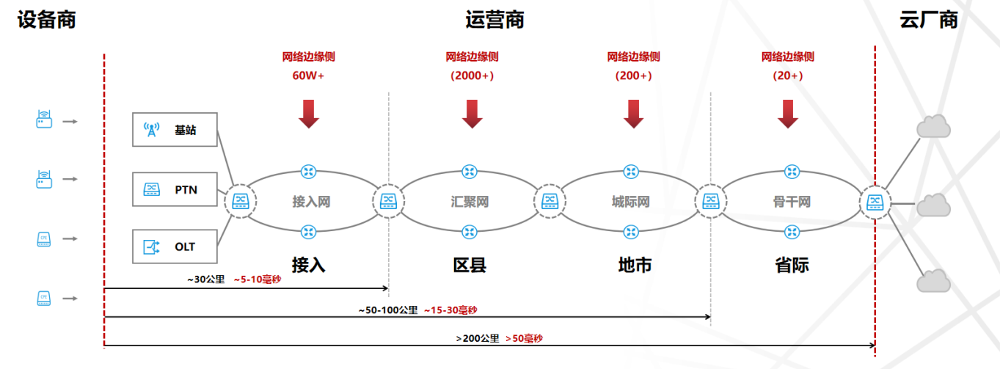

边缘计算位于中心云及终端之间，将云计算能力由中心下沉到边缘，通过云边协同的架构解决特定的业务需求，能**最大程度降低传输时延**，这也是边缘计算的核心价值。边缘计算的具体位置由网络与业务需求定义。

边缘计算生态参与者众多，云厂商、设备厂商、运营商三大关键服务商方以及一些新型 AI 服务商等，都是从各自现有优势延伸，拓展更多客户及市场空间。

- 设备商借助物联网逐渐构建单一功能的专业云
- 云厂商从中心化的公有云开始下沉，走向分布式区域云，区域云之间通过云联网打通，形成一个覆盖更大的云
- 运营商在互联网时代被公有云及繁荣的移动应用完全屏蔽只能充当管道，但在边缘计算时代，业务及网络定义边缘计算，运营商重新回归焦点

#### 1.2.2 云计算的类型

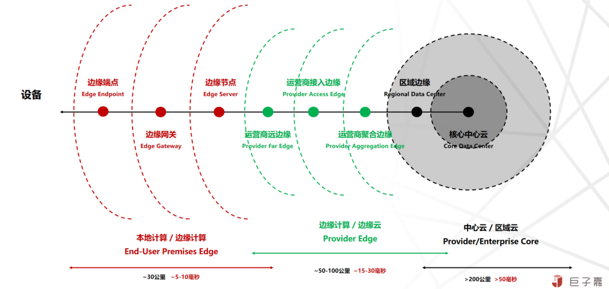

- 区域云/中心云：将中心云计算的服务在骨干网拓展延伸，将中心化云能力拓展至区域，实现区域全覆盖，解决在骨干网上耗时，将网络延迟优化至 **30ms** 左右，但逻辑上仍是中心云服务。
- 边缘云/边缘计算：将中心云计算的服务沿着运营商的网络节点延伸，构建中小规模云服务或类云服务能力，将网络延迟优化至 **15ms** 左右，比如多接入边缘计算（MEC）、CDN。
- 边缘计算/本地计算：主要是接近终端的现场设备及服务能力，将终端部分逻辑剥离出来，实现边缘自主的智能服务，由云端控制边缘的资源调度、应用管理与业务编排等能力，将网络延迟优化至 **5ms** 左右，比如多功能一体机、智能路由器等。

边缘云和边缘计算对大多数业务来说，是锦上添花；只有对时延极其敏感的高速工控领域，才是雪中送碳。

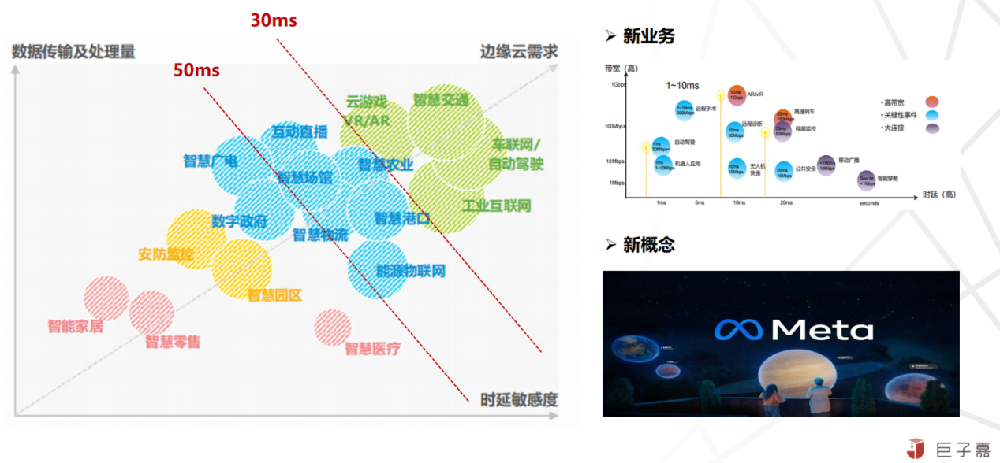

网络的能力限制了边缘计算和物联网的发展。云网融合与算力网络依然还是运营商的独家游戏，5G 技术只解决了海量设备接入及设备低延迟接入的问题，后端整体配套及解决方案还是跟不上。

当前还是 5G 找业务的尴尬局面，未来 5G 在实体产业领域（港口， 码头，矿山等）领域，相比消费者领域，相信会带来更大变革与价值。

#### 1.2.3 面向实体产业的边缘计算

除了面向消费者的**互联网边缘场景**，边缘计算更多的是**面向实体产业及智慧化社会衍生**的场景。
​
对于**实体产业场景**来说，由于历史原因，在边缘及现场存在大量异构的基础设施资源；通过业务需求驱动边缘计算平台的建设，不仅要整合利用现有基础设施资源，还要将中心云计算技术及能力下沉至边缘及现场，实现大量存量业务运营管控上云，海量数据统一入湖，以此支持整个企业的数字化转型。
​
对于**智慧化社会衍生场景**来说，越是新型的业务，对网络时延敏感越高，数据量越大，结构化数据逐渐转化成非结构化数据，需要人工智能，神经网络等高等智能化技术支持。
​
当前对网络时延敏感的新型业务场景，都是通过云端总控管理，设备现场实时计算这种分布式架构策略，以此减弱对网络的强依赖。面向业务将边缘计算分为**智能设备/专业云**及**产业边缘/行业云**两种类型：

- 智能设备/专业云：基于云计算能力之上，围绕智能设备提供整体化，有竞争力的解决方案，包含智能设备、云端的服务以及端到云之间的边缘侧服务，比如视频监控云、G7 货运物联等
- 产业边缘/行业云：也基于云计算能力之上，围绕行业应用及场景，提供套件产品及解决方案，比如物流云、航天云等。

总的来说，基于业务定义的边缘计算，更多是面向智能设备及实体产业，对智能设备，从 AVG，密集式存储，机械手臂等单一功能的智能设备，到无人机，无人驾驶车等超复杂的智能设备，云计算能力不仅支撑设备控制管理应用的运行，同时借助中心云计算能力拓展至边缘侧，解决这种产品上云，无法**集中化标准化管理**难题；对产业边缘，通过云计算技术，结合行业场景的抽象总结，**构建行业通用的产品及解决方案**，随着整个产业互联网加速建设，是边缘计算未来发展的重点方向。

边缘计算范围大，场景泛，目前整个行业缺少经典的案例及标准。因此推动边缘计算落地，一定是面向真实的业务场景及需求整体规划，面向价值逐步建设。

总之，判断应该用中心云，还是边缘云，可以依据如下标准：

- **从业务应用来看**，财务/经营，计划/管理两层属于管控运营类的应用，就是需要通过中心云统一汇聚，实现集中化强管控；对延迟不敏感，对安全，大数据分析能力等要求较高；控制，传感/执行，生产过程三层属于运作支撑类应用，也可以优先考虑中心云；如果业务场景对延迟敏感，才考虑通过边缘计算能力，实现分散式低时延响应
- **从请求响应来看**，对时延不敏感（50ms 以上）都有限考虑部署在中心云计算及云化的边缘产品（CDN）实现；对延迟敏感（小于10ms ），运营商骨干网完全无法支持的，考虑建设边缘计算平台，同时业务面临不小的投入及人员

## 2. 场景理解

2022 年，中国信通院发布《[“边缘计算+”技术白皮书](http://www.ecconsortium.org/Uploads/file/20220928/1664354566370058.pdf)》，展示了边缘计算在多个行业的应用前景。

1. 按应用分类：
    - 智慧水利
    - 智慧场馆
    - 智能制造
    - 新媒体
    - 智慧文旅
    - 智慧医疗
    - 智慧园区
    - 智慧港口
    - 智慧网联
2. 按产品分类
    - 边缘一体机柜
    - 边缘眼
    - VR
    - AR 远程协作
    - 视频处理
    - 广告插入
    - 智慧系统
    - 智能巡检
    - 医疗分析
    - 自动导航

“边缘计算+”参考模型

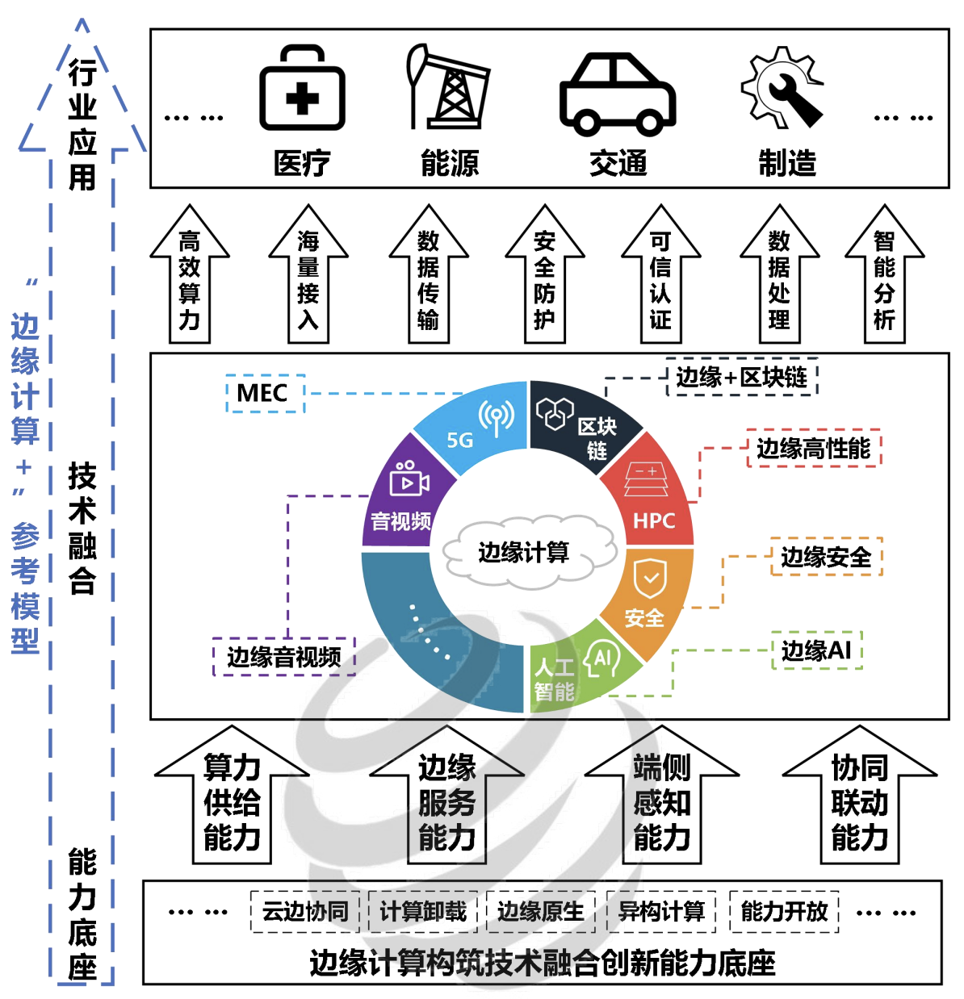

- 在边缘计算与 5G 技术融合方面，边缘计算充分结合5G eMBB高带宽、uRLLC 极低时延、mMTC 大连接等特性，将云的能力下沉到移动网络边缘，满足车路协同场景、智能制造场景、智慧能源场景等众多场景，在高通量实时智能分析等方面的处理需求。
- 在边缘计算与人工智能技术融合方面，伴随行业数字转型浪潮的到来，结合边缘计算与人工智能的边缘人工智能技术，将人工智能算法运行在边缘侧，满足智慧交通、智慧物流、智慧水利等众多场景的实时性、本地化的智能处理需求。
- 在边缘计算和音视频技术融合方面，以超高清视频、工业视觉、AR/VR 等为代表的视频应用，借助边缘计算“低时延、高带宽、大连接”的先天优势，助力各行业数字化转型，满足各行业对视频业务实时性、视频数据智能化等方面的需求。
- 在边缘计算与区块链技术融合方面，通过在边缘计算节点上部署区块链服务，既可以为行业应用提供实时的数据存储，也可以提供可信的数据分析和业务执行。
在边缘计算与安全技术融合方面，边缘计算节点需要面对海量设备接入，在隐私保护、数据安全等方面面临诸多挑战。
- 边缘计算与安全技术的融合，一方面体现在构建安全可用的边缘计算生态系统，保护边缘计算设备、基础设施、边缘应用等边缘计算架构安全；另一方面，可以在边缘侧提供安全网关、安全检测等各类安全服务。
- 在边缘计算与高性能计算技术融合方面，自动驾驶、数字制造等场景需要在边缘侧提供高性能算力资源与计算架构，满足计算密集型任务的处理需求。于此同时，高性能计算应用上云已成为行业发展的必然趋势，通过在边缘侧和云侧同时部署云化 HPC 应用，将充分满足行业应用灵活、弹性的高性能算力需求。

边缘 AI 架构

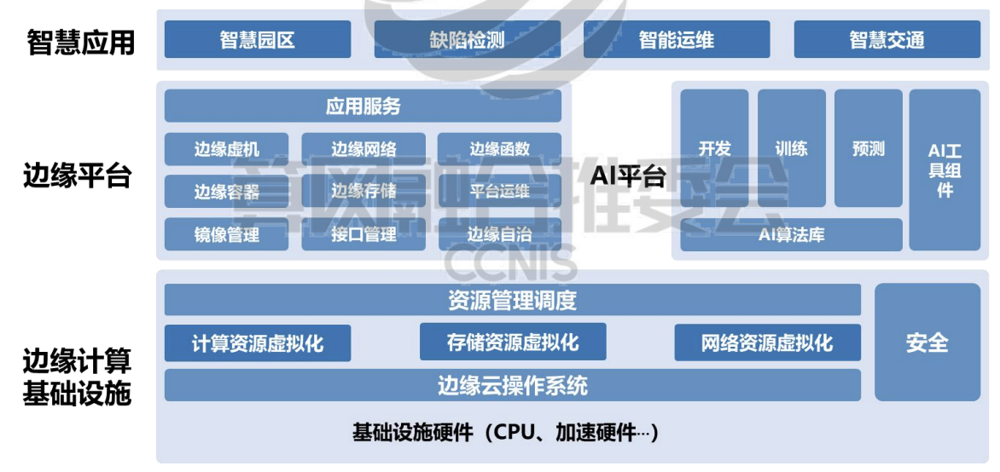

### 2.1 矿业

智慧石油场景中，“边缘计算+”将重点解决由于油井地理位置偏远，给油井现场、设备的实时管理和监控带来挑战。利用MEC的接入能力，结合边缘视频处理技术以及边缘AI 能力，实现现场级的油井异物入侵、人员行为检测、设备状态监控等业务能力，降低业务成本，保障石油开采过程中人员设备安全。

以及视频安防

### 2.2 车路协同

车路协同场景中，利用“边缘计算+”提供的边缘AI 能力，实现道路与车辆相关信息的实时智能分析；通过MEC 技术实现车-路、人-车、车-车之间的高速信息交互；通过边缘 HPC（高性能计算）提供的强大算力，实现对外部环境突发情况的及时响应。

### 2.3 视频直播

视频点播/直播场景中，利用“边缘计算+”提供边缘音视频技术实现包括转码、合流、切片等在内的视频流边缘处理，直播流可以就近分发、就近访问，减少网络传输时延，降低网络带宽成本，提高用户的服务体验。

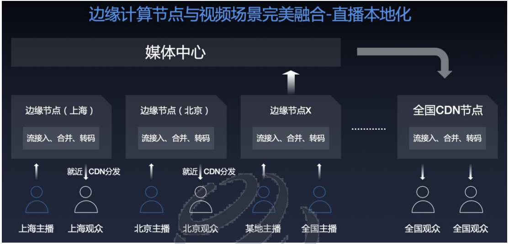

### 2.4 智慧园区

智能园区场景中，利用边缘计算+区块链技术，可以实现园区内监控视频的本地存储与视频存证，保证视频数据的真实性和可信度。另外，利用边缘 AI 技术，可以实现智能化的车辆识别，降低安保压力。

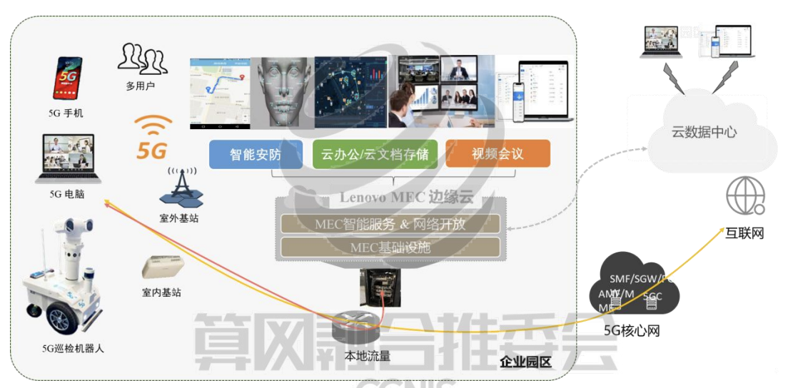

区块链

### 2.5 无人零售

无人零售场景中，边缘 AI 技术提供的智能化数据处理能力，满足货品监测、收银记录、人员识别等多个无人零售核心业务需求。在基础设施方面，利用边缘 HPC 技术，提供优秀的性能功耗比，令计算密级型 AI 应用运行于低功耗的设备中，满足业务场景对性能和功耗的苛刻要求。

### 2.6 工业质检

## 3. 技术解读

### 3.1 边缘云方案

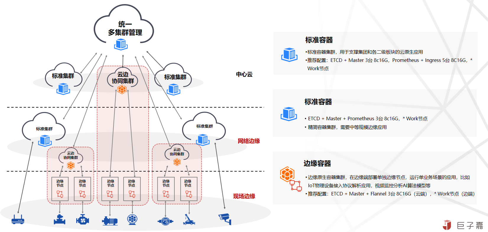

现阶段，围绕 Kubernetes 容器平台，构建云边一体化云原生基础设施平台能力是边缘计算平台的最佳选择，通过云端统一的容器多集群管理，实现分散式集群统一管理，同时标准化 Kubernetes 集群规格配置：

- 标准集群（大规模）：支持超过 400 个节点的大规模集群，配置为 ETCD + Master 3 台 8c16G，Prometheus + Ingress 5 台 8C16G， N * Work 节点；主要是业务规模较大的云原生应用运行场景；
- 标准集群（中等规模）：支持超过 100 个节点以内的集群，ETCD + Master + Prometheus 3 台 8c16G，N * Work 节点；主要是业务规模中等的场景；
- 边缘原生容器集群：在云端部署集群管理节点，将边缘节点单独部署业务现场，支持运行单业务场景的应用，比如 IoT 物理设备接入协议解析应用，视频监控分析 AI 算法模型等业务场景。

#### 3.1.1 最常见的标准 K8S 边缘云方案

当前边缘容器领域暂无大一统的开源产品（也没有看到明显的强势产品），因此现阶段建议通过标准的 Kubernetes API 来集成边缘原生容器集群，这种兼容所有边缘容器的中庸方案。

多集群管理：

1. K8S Federation & [Karmada](https://karmada.io/zh/blog/2022/10/26/test-report/)，能管理 100 个集群
2. [AutoK3S](https://docs.rancher.cn/docs/k3s/autok3s/_index/) & [KubeClipper](https://github.com/kubeclipper/kubeclipper) & CMP，理论上可以扩展到远超 100 集群的规模

多集群分发：[KubeVela](https://kubevela.net/zh/docs/next/)

KubeVela 的核心是将应用部署所需的所有组件和各项运维动作，描述为一个统一的、与基础设施无关的“部署计划”，进而实现在混合环境中标准化和高效率的应用交付。这使得最终用户无需关注底层细节，就可以使用丰富的扩展能力，并基于统一的概念自助式操作。

#### 3.1.2 KubeEdge

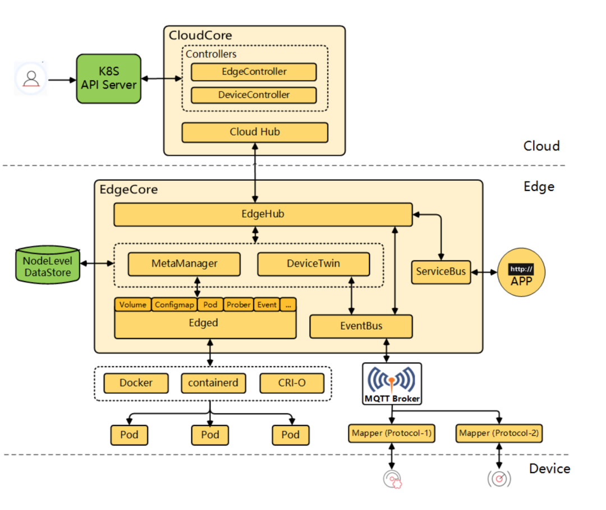

KubeEdge架构上清晰地分为三层，分别是：云端、边缘和设备层。

云端

- cloudhub 部署在云端，接收 edgehub 同步到云端的信息
- edgecontroller 部署在云端，用于控制 Kubernetes API Server 与边缘的节点、应用和配置的状态同步

边缘

- edged是个重新开发的轻量化Kubelet，实现Pod，Volume，Node等Kubernetes资源对象的生命周期管理
- metamanager负责本地元数据的持久化，是边缘节点自治能力的关键
- edgehub是多路复用的消息通道，提供可靠和高效的云边信息同步
- devicetwin用于抽象物理设备并在云端生成一个设备状态的映射
- eventbus订阅来自于MQTT Broker的设备数据。

KubeEdge 边云网络访问依赖 EdgeMesh：

- EdgeMesh-Server 运行在云上节点，具有一个公网 IP，监听来自EdgeMesh-Agent 的连接请求，并协助 EdgeMesh-Agent 之间完成 UDP 打洞，建立 P2P 连接;在 EdgeMesh-Agent 之间打洞失败的情况下，负责中继 EdgeMesh-Agent 之间的流量，保证 100% 的流量中转成功率
- EdgeMesh-Agent工作原理：
    - DNS模块，是内置的轻量级DNS Server，完成Service域名到ClusterIP的转换
    - Proxy 模块，负责集群的 Service 服务发现与 ClusterIP 的流量劫持
    - Tunnel 模块，在启动时，会建立与 EdgeMesh-Server 的长连接，在两个边缘节点上的应用需要通信时，会通过 EdgeMesh-Server 进行 UDP 打洞，尝试建立 P2P 连接，一旦连接建立成功，后续两个边缘节点上的流量不需要经过 EdgeMesh-Server 的中转，进而降低网络时延

#### 3.1.3 腾讯的 SuperEdge

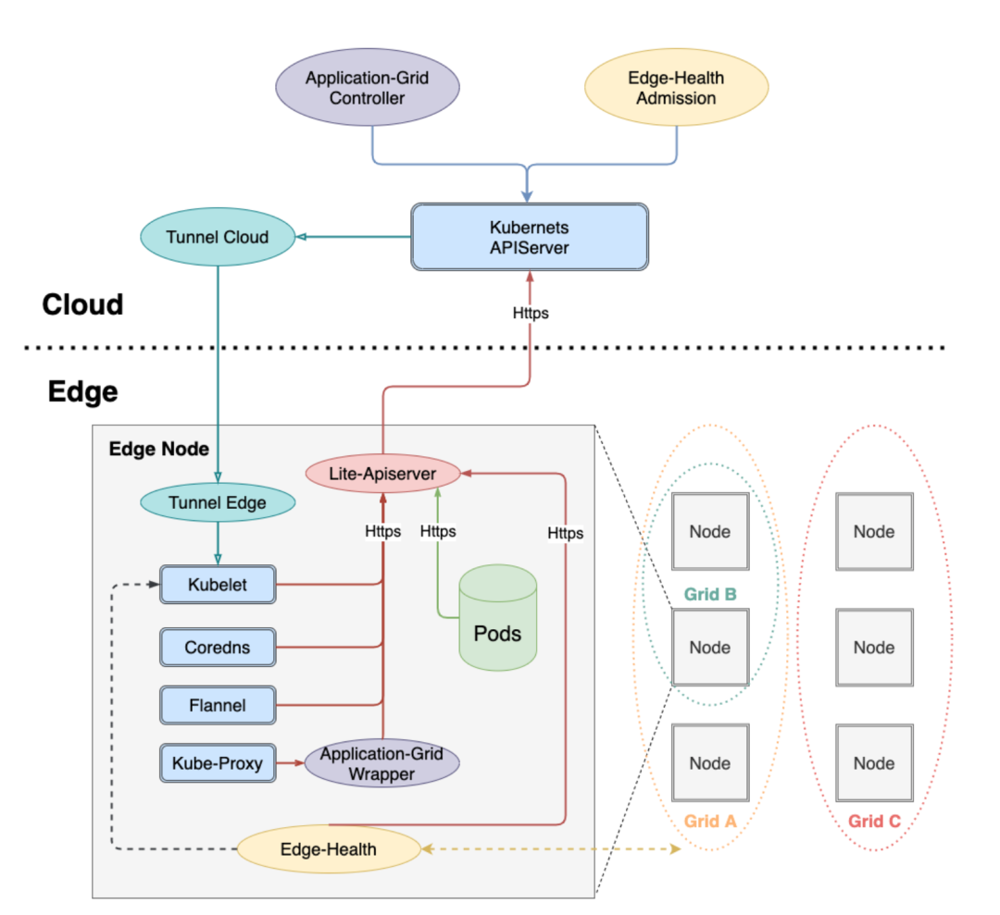

SuperEdge 是腾讯推出的 Kubernetes-native 边缘计算管理框架。相比 openyurt 以及 kubeedge，SuperEdge 除了具备 Kubernetes 零侵入以及边缘自治特性，还支持独有的分布式健康检查以及边缘服务访问控制等高级特性。

#### 3.1.4 OpenYurt

[OpenYurt 架构](https://openyurt.io/zh/docs/core-concepts/architecture)

OpenYurt 的架构设计比较简洁，采用的是无侵入式对 Kubernetes 进行增强。 在云端上增加 Yurt Controller Manager, Yurt App Manager 以及Tunnel Server 组件。 而在边缘端上增加了 YurtHub 和 Tunnel Agent 组件。 从架构上看主要增加了如下能力来适配边缘场景：

- YurtHub: 代理各个边缘组件到 K8s Master 的通信请求，同时把请求返回的元数据持久化在节点磁盘。当云边网络不稳定时，则利用本地磁盘数据来用于边缘业务的生命周期管控。同时云端的 Yurt Controller Manager 会管控边缘业务 Pod 的驱逐策略。
- Tunnel Server/Tunnel Agent: 每个边缘节点上的Tunnel Agent将主动与云端Tunnel Server建立双向认证的加密的gRPC连接，同时云端将通过此连接访问到边缘节点及其资源。
- Yurt App Manager：引入的两个 CRD 资源: NodePool 和 UnitedDeployment. 前者为位于同一区域的节点提供批量管理方法。后者定义了一种新的边缘应用模型以节点池维度来管理工作负载。

#### 3.1.5 边缘云方案异同总结

1. 运维操作：OpenYurt 可以通过命令将 Kubernetes 集群转换为 OpenYurt 集群，将 OpenYurt 集群转换为 Kubernetes 集群。
2. 侵入性：OpenYurt 完整的保留 kubelet，KubeEdge 的 edged 组件是个重新开发的轻量化 Kubelet，实现 Pod，Volume，Node 等 Kubernetes 资源对象的生命周期管理。
3. 资源使用：OpenYurt 对边缘节点的资源要求较高，2U4G 起步，这个要求不管手机还是树莓派都可以轻松满足，要求不算苛刻，KubeEdge 在边缘运行内存只有区区几十兆，做到了至极轻量，但功能精简严重，随着版本的升级，功能逐渐增加，对资源的消耗也逐渐在增加
4. OpenYurt 相对于 KubeEdge 跟随 Kubernetes 版本升级零负担，OpenYurt 非常容易扩展出更多的能力

#### 3.1.6 落地过程中的挑战

1. 基础镜像及应用镜像下发，当前的基础镜像及业务镜像，即使在中心云，依然在探索各种技术来优化镜像快速分发的瓶颈；尤其是边缘的 AI 应用，一般都是由推送应用+模型库构成，推算应用的镜像相对较小，模型库的体积就非常大，同时模型库随着自学习还需要频繁的更新，如果更高效的更新模型库，需要更多技术及方案来应对。
2. Kubelet 比较重，运行占用资源多
3. K8S-Native 云边缘方案有两大问题：
    - 引入了额外的 EdgeMesh / Tunnel 组件，增加了网络复杂度，排错复杂
    - 使用长链接，需要双向联通，并且一对多不易

#### 3.1.7 未来的优化思路

1. 模型的切割和分布式推理
2. 模型压缩
3. 轻量化定制 Kubelet

### 3.2 GPU 切分方案

- vGPU
- GPU 基于 MIG 的切分
- 基于时间片
- 基于负反馈 CUDA 劫持

### 3.3 利于边缘场景的运维优化点

- 证书超长有效期配置
- ETCD 拆分
- 存储层性能优化：跨 NS 写时复制
- 容器运行时的优化：Pod 强隔离
- 基于 SPDK 提升存储性能

### 3.4 统一认证方案

- Keystone
- Casdoor（安全上云）
- ABAC 方案：基于 Keystone 的扩展

### 3.5 智算云

架构

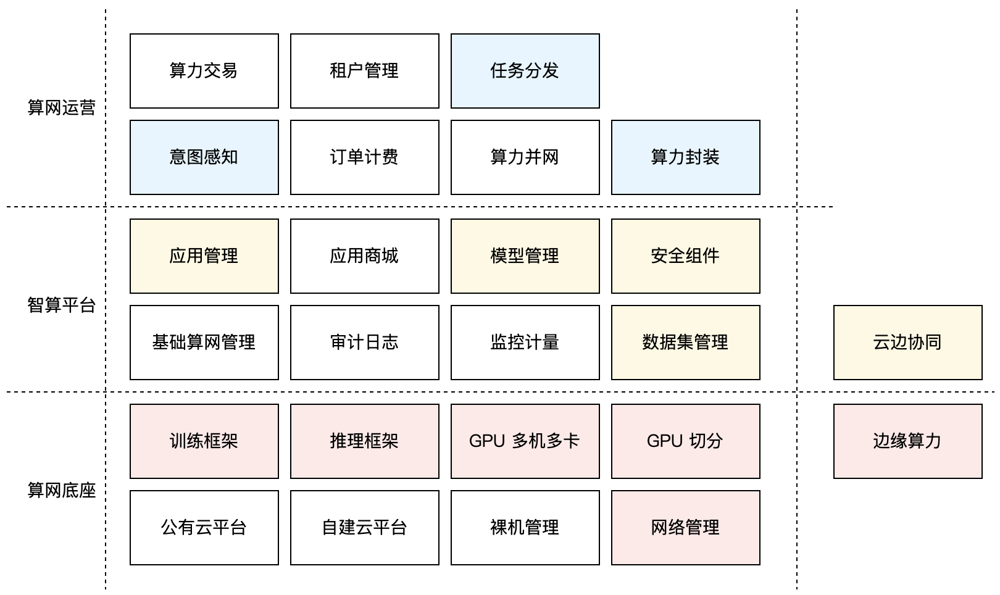

云上和云下

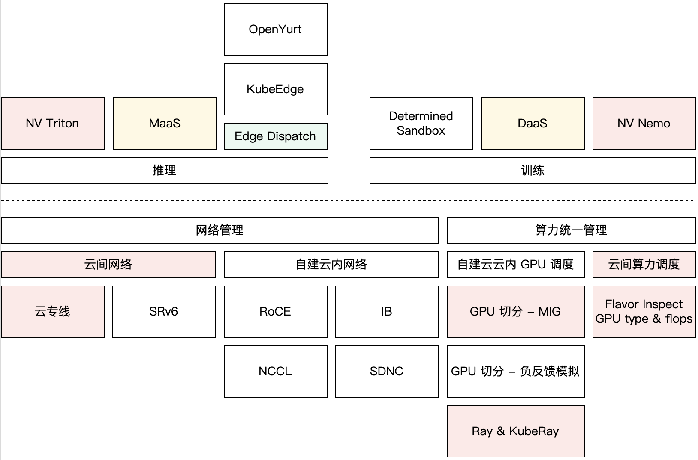

智算中心体系架构

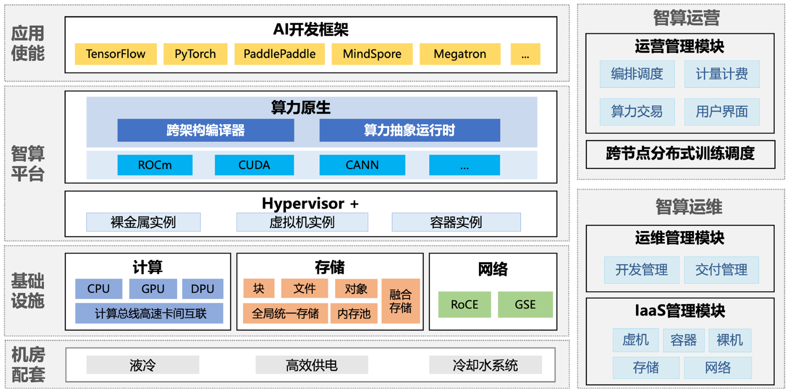

MLOps & AIStudio

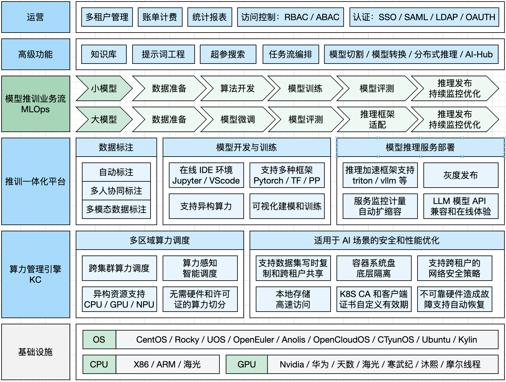
